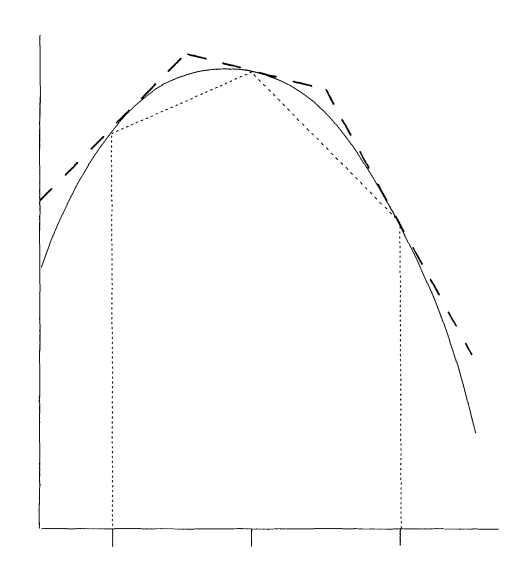

The **accept-reject method**, also called **rejection sampling**, is a simple and general technique for generating random variables. It is based on the idea of sampling from a simple distribution and then rejecting the samples that are not in the desired distribution. This method is particularly useful when the desired distribution is difficult to sample from directly, but it is easy to evaluate the density function of the distribution.

::: {.callout-tip}
## Why Use Accept-Reject?

The accept-reject method is especially valuable when:

- Direct sampling from the target distribution is complex or impossible.
- The probability density function (PDF) can be easily evaluated.
- We can find a suitable bounding function for the target distribution.
:::

## Mathematical Foundations

For the accept-reject method, we need to recall the following definitions:

Let $X$ and $Y$ be discrete random variables. 

The **joint distribution** of $X$ and $Y$ is given by the probability mass function 

$$f_{X,Y}(x,y) = \mathbb{P}(X=x, Y=y)$$ {#eq-joint-pmf}

The **marginal distribution** of $X$ is given by the probability mass function

$$f_X(x) = \mathbb{P}(X=x) = \sum_{y} f_{X,Y}(x,y)$$ {#eq-marginal-pmf}

The **conditional probability** of $X$ given $Y$ is defined as

$$f_{X|Y}(x|y) = \mathbb{P}(X=x|Y=y) = \frac{f_{X,Y}(x,y)}{f_Y(y)}$$ {#eq-conditional-pmf}

::: {.callout-tip}
## Continuous Case
When $X$ and $Y$ are continuous random variables, the definitions are similar, but we replace the probability mass functions with probability density functions and sums with integrals.
:::

## Theoretical Foundation

The **accept-reject method** is based on the following fundamental theorem:

::: {#thm-marginal-of-uniform}
## Marginal of Uniform Distribution

Let $p(x)$ be a probability distribution. Let $X, Y$ be two random variables having the joint distribution

$$f_{X,Y}(x,y) = \begin{cases}
1, & \text{if } 0 \leq y \leq p(x), \\
0, & \text{otherwise}.
\end{cases}$$ {#eq-uniform-joint-distribution}

Then the marginal distribution of $X$ is given by $p(x)$.
:::

::: {.proof}
The marginal distribution of $X$ is given by

$$f_X(x) = \int_{-\infty}^{\infty} f_{X,Y}(x,y) \, dy = \int_{0}^{p(x)} 1 \, dy = p(x)$$

$\blacksquare$
:::

::: {.callout-tip}
## Geometric Interpretation
This theorem tells us that if we sample uniformly from the region under the curve $y = p(x)$, the $x$-coordinates of these samples will follow the distribution $p(x)$. This is the key insight behind the accept-reject method.
:::

Thus, in order to sample from a distribution $p(x)$, we want to devise a method to sample from the joint distribution given by @eq-uniform-joint-distribution. The accept-reject method provides exactly such a technique.

## Accept-Reject Method: Basic Algorithm

Suppose $p(x)$ is a probability distribution from which we want to sample. Suppose further that $p(x)$ is supported over the interval $[a, b]$ and is bounded by $M$, i.e., $p(x) \leq M$ for all $x \in [a, b]$.

::: {.callout-note}
## Algorithm: Basic Accept-Reject Method

The simplest version of the accept-reject method proceeds as follows:

1. **Generate proposal**: Sample $x$ uniformly from $[a, b]$.
2. **Generate test value**: Sample $y$ uniformly from $[0, M]$.  
3. **Accept or reject**: If $y \leq p(x)$, **accept** and return $x$; otherwise, **reject** and go back to step 1.
:::

::: {.callout-warning}
## Efficiency Considerations
The acceptance probability for this basic method is $\frac{\int_a^b p(x) dx}{M(b-a)} = \frac{1}{M(b-a)}$ (since $p(x)$ is a probability density). For efficiency, we want $M(b-a)$ to be as small as possible, which means finding a tight upper bound $M$.
:::

### Worked Example

::: {#exm-triangular-distribution}
## Example: Triangular Distribution

Consider the triangular distribution 

$$p(x) = \begin{cases}
4x, & \text{if } 0 \leq x \leq 0.5, \\
4(1-x), & \text{if } 0.5 \leq x \leq 1 \\ 
0, & \text{otherwise}.
\end{cases}$$ {#eq-triangular-distribution}

**Analysis:**

- **Support**: $[a,b] = [0, 1]$.  
- **Maximum value**: $M = \max_{x \in [0,1]} p(x) = p(0.5) = 2$.
- **Acceptance probability**: $\frac{1}{M(b-a)} = \frac{1}{2 \cdot 1} = 0.5$.

**Algorithm application:**

1. Sample $x \sim \text{Uniform}(0, 1)$.
2. Sample $y \sim \text{Uniform}(0, 2)$.  
3. If $y \leq p(x)$, accept $x$; otherwise reject and repeat.

On average, we expect to reject half of our proposals.
:::

::: {.callout-tip}
## Implementation Note
In practice, you would implement this algorithm in a loop until you obtain the desired number of samples. The triangular distribution is actually simple enough that direct methods exist, but it serves as a good example for understanding the accept-reject principle.
:::

```{ojs}
//| output: false
VM = window.VM
vmTheme = Generators.observe(notify => VM.plotting.onThemeChange(notify))
chartColors = VM.plotting.colors(vmTheme)

arTargetPlot = VM.plotting.persistentPlot({height: "340px"})
arBoxPlot = VM.plotting.persistentPlot({height: "420px"})
arBoxHistPlot = VM.plotting.persistentPlot({height: "340px"})
arProposalPlot = VM.plotting.persistentPlot({height: "340px"})
arBetaPlot = VM.plotting.persistentPlot({height: "420px"})
arBetaHistPlot = VM.plotting.persistentPlot({height: "340px"})

// The target: the triangular density on [0, 1] with its peak at 1/2.
function arTarget(x) {
  if (x < 0 || x > 1) return 0
  if (x < 0.5) return 4 * x
  return 4 * (1 - x)
}

// The Beta(2, 2) proposal density.
function arBeta(x) {
  if (x < 0 || x > 1) return 0
  return 6 * x * (1 - x)
}

arGrid = {
  const xs = []
  for (let i = 0; i <= 200; i++) xs.push(i / 200)
  return xs
}

function arCurve(fn, color, name, dash) {
  const ys = []
  for (const x of arGrid) ys.push(fn(x))
  return {x: arGrid, y: ys, type: "scatter", mode: "lines", name, line: {color, width: 2, dash: dash ?? "solid"}}
}

// Scatter of every proposal (x, y): accepted points under the target
// density, rejected ones above it.
function arScatter(sample) {
  const ax = [], ay = [], rx = [], ry = []
  for (let i = 0; i < sample.xs.length; i++) {
    if (sample.accepted[i]) {
      ax.push(sample.xs[i])
      ay.push(sample.ys[i])
    } else {
      rx.push(sample.xs[i])
      ry.push(sample.ys[i])
    }
  }
  return [
    {x: rx, y: ry, type: "scattergl", mode: "markers", name: "Rejected", marker: {color: chartColors.warn, size: 2}, hoverinfo: "skip"},
    {x: ax, y: ay, type: "scattergl", mode: "markers", name: "Accepted", marker: {color: chartColors.fn, size: 2}, hoverinfo: "skip"}
  ]
}

// Density histogram of the accepted x's under the target density.
function arHistogram(sample) {
  const kept = []
  for (let i = 0; i < sample.xs.length; i++) {
    if (sample.accepted[i]) kept.push(sample.xs[i])
  }
  const bins = VM.distributions.histogramBins(kept, 100, {lo: 0, hi: 1})
  return [
    {x: bins.centers, y: bins.densities, type: "bar", name: "Accepted samples", marker: {color: VM.plotting.alpha(chartColors.fn, 0.6)}},
    arCurve(arTarget, chartColors.alt, "Target density")
  ]
}

function arEfficiency(sample) {
  let count = 0
  for (const a of sample.accepted) {
    if (a) count++
  }
  return count / sample.xs.length
}
```

```{ojs}
arTargetPlot([arCurve(arTarget, chartColors.fn, "p(x)")], {
  showlegend: false, xaxis: {title: "x"}, yaxis: {title: "p(x)", range: [0, 2.2]},
  shapes: [{type: "line", xref: "paper", x0: 0, x1: 1, y0: 2, y1: 2, line: {color: chartColors.alt, dash: "dash", width: 2}}]
})
```
    


```{ojs}
//| output: false
// Uniform proposals on the box [0, 1] x [0, M] with M = 2.
arBoxSample = {
  const M = 2
  const n = 10000
  const rng = VM.sampling.seededRandom(1)
  const xs = [], ys = [], accepted = []
  for (let i = 0; i < n; i++) {
    const x = rng()
    const y = M * rng()
    xs.push(x)
    ys.push(y)
    accepted.push(y < arTarget(x))
  }
  return {M, xs, ys, accepted}
}
```

```{ojs}
VM.plotting.plotWithLegend(arBoxPlot, arScatter(arBoxSample), {
  title: {text: `Efficiency = accepted / generated = ${arEfficiency(arBoxSample).toFixed(2)} ≈ 1/${arBoxSample.M}`},
  margin: {t: 40}, xaxis: {title: "x"}, yaxis: {title: "y"},
  shapes: [{type: "line", xref: "paper", x0: 0, x1: 1, y0: 2, y1: 2, line: {color: chartColors.alt, dash: "dash", width: 2}}]
})
```


    
    


```{ojs}
VM.plotting.plotWithLegend(arBoxHistPlot, arHistogram(arBoxSample), {
  title: {text: "Histogram of the accepted points"}, margin: {t: 40}, bargap: 0,
  xaxis: {title: "x"}, yaxis: {title: "density"}
})
```


    


### Efficiency

Note that unlike the methods we have seen so far, the accept-reject method is probabilistic. The method generates uniformly distributed samples in the rectangle of area $M(b-a)$, where $M$ is the bound on $p(x)$ and $[a, b]$ is the support of $p(x)$. But because $p(x)$ is a probability distribution, the area under the curve is 1. Thus the efficiency of the accept-reject method is given by

$$\text{Efficiency} = \frac{1}{M(b-a)}$$ {#eq-efficiency}

::: {.callout-warning}
## Efficiency Trade-offs

If $M$ is large (i.e., the probability distribution has a large peak), then the efficiency of the accept-reject method is low. This means:

- **High peaks**: Lead to many rejected samples and slower convergence.
- **Tight bounds**: Finding the smallest possible $M$ is crucial for good performance.
- **Wide support**: Large intervals $[a,b]$ also reduce efficiency.
:::

::: {.callout-tip}
## Geometric Interpretation of Efficiency

The efficiency represents the fraction of the bounding rectangle that lies under the target density curve. In our triangular distribution example:

- Rectangle area: $M(b-a) = 2 \times 1 = 2$
- Area under curve: $\int_0^1 p(x) dx = 1$ 
- Efficiency: $\frac{1}{2} = 50\%$

This means we accept exactly half of our proposals on average.
:::


## Accept-Reject Method v2

A better version of the accept-reject method is obtained by replacing the enveloping rectangle with an enveloping curve. The closer the enveloping curve is to the distribution, the higher the efficiency of the method.

::: {#def-majorizing-function}
## Definition: Majorizing Function

Let $p(x)$ be a probability distribution. A function $g(x)$ is said to **majorize** $p(x)$ if $g(x) \geq p(x)$ for all $x$ in the support of $p(x)$.

In the accept-reject jargon, we call $p(x)$ the **target distribution** and $g(x)$ the **proposal distribution**. Note that a probability distribution can never majorize another probability distribution as the area under the curve is 1. But we can scale the proposal distribution by a constant $M$ such that $Mg(x)$ majorizes $p(x)$.
:::

::: {.callout-important}
## Key Requirements for Proposal Distribution

For $g(x)$ to be a valid proposal distribution, it must satisfy:

- **Majorization**: $Mg(x) \geq p(x)$ for all $x$ in the support of $p(x)$.
- **Easy sampling**: We must be able to easily generate samples from $g(x)$.
- **Easy evaluation**: Both $g(x)$ and $p(x)$ must be easy to evaluate.
- **Efficiency**: $Mg(x)$ should be as close to $p(x)$ as possible to minimize rejections.
:::

### Improved Algorithm

::: {.callout-note}
## Algorithm: Accept-Reject with Proposal Distribution

Given a target distribution $p(x)$ and a proposal distribution $g(x)$ with scaling constant $M$ such that $Mg(x) \geq p(x)$:

1. **Generate proposal**: Sample $x$ from the proposal distribution $g(x)$.
2. **Generate test value**: Sample $u$ uniformly from $[0, 1]$.
3. **Accept or reject**: If $u \leq \frac{p(x)}{Mg(x)}$, **accept** and return $x$; otherwise, **reject** and go back to step 1.
:::

::: {.callout-tip}
## Why This Works
The acceptance probability $\frac{p(x)}{Mg(x)}$ ensures that we accept samples with probability proportional to how well the target density $p(x)$ matches the scaled proposal density $Mg(x)$ at point $x$.
:::

### Worked Example

::: {#exm-majorizing-function}
## Example: Beta Proposal for Triangular Distribution

Consider the triangular distribution given by @eq-triangular-distribution. We saw that we can use the enveloping rectangle with $M = 2$ to sample from this distribution. The Beta distribution $\text{Beta}(2, 2)$ provides a better majorizing function with constant $M = 4/3$.

The $\text{Beta}(2, 2)$ distribution has density:
$$g(x) = 6x(1-x), \quad x \in [0, 1]$$ {#eq-beta-22}


```{ojs}
VM.plotting.plotWithLegend(arProposalPlot, [
  arCurve(arTarget, chartColors.fn, "Triangular distribution"),
  arCurve(arBeta, chartColors.alt, "Beta distribution"),
  arCurve(x => 4 / 3 * arBeta(x), chartColors.ok, "1.33 · Beta distribution", "dash")
], {xaxis: {title: "x"}, yaxis: {title: "density", rangemode: "tozero"}})
```

**Efficiency comparison:**

- **Rectangle method**: Efficiency = $\frac{1}{2 \cdot 1} = 50\%$
- **Beta proposal**: Efficiency = $\frac{1}{M} = \frac{1}{4/3} = 75\%$

The Beta proposal method is significantly more efficient!
:::

::: {.callout-warning}
## Finding the Optimal Scaling Constant
The scaling constant $M$ should be chosen as the smallest value such that $Mg(x) \geq p(x)$ for all $x$. This typically requires:
$$M = \max_x \frac{p(x)}{g(x)}$$
Finding this maximum may require calculus or numerical optimization.
:::

In order to run the accept-reject method, we need to sample uniformly from the region between the graph of $Mg(x)$ and the $x$-axis. This can be done using the following theorem:

::: {#thm-majorizing-function}
## Uniform Sampling Under Majorizing Function

Let $g(x)$ be a probability distribution and let $M$ be a constant. Let $X$ and $Y$ be two random variables such that $X \sim g(x)$ and $(Y | X = x) \sim U(0, Mg(x))$. Then the joint distribution of $X$ and $Y$ is uniform over the region between the graph of $Mg(x)$ and the $x$-axis.
:::

::: {.proof}
The conditional probability of $Y$ given $X$ is given by

$$f_{Y|X}(y|x) = \begin{cases}
\frac{1}{Mg(x)}, & \text{if } 0 \leq y \leq Mg(x), \\
0, & \text{otherwise}.
\end{cases}$$

Hence, the joint distribution of $X$ and $Y$ is given by

$$f_{X,Y}(x,y) = f_{Y|X}(y|x) g(x) = \begin{cases}
\frac{1}{M}, & \text{if } 0 \leq y \leq Mg(x), \\
0, & \text{otherwise}.
\end{cases}$$

Hence, the joint distribution is uniform over the region between the graph of $Mg(x)$ and the $x$-axis.

Note that we are seeing the constant $1/M$ instead of 1 as the area under the curve $y = Mg(x)$ is $M$ and not 1.

$\blacksquare$
:::

::: {.callout-tip}
## Geometric Interpretation
This theorem establishes that we can generate uniform points under any scaled probability density $Mg(x)$ by first sampling from the base distribution $g(x)$, then sampling uniformly in the vertical direction up to the curve height.
:::

## Complete Algorithm with Proposal Distribution

This gives us a way to sample from the majorizing function $g(x)$. We can then use the accept-reject method to sample from the target distribution $p(x)$. 

::: {.callout-note}
## Algorithm: Accept-Reject with Majorizing Function (Version 1)

1. Sample $x$ from $g(x)$.
2. Sample $y$ uniformly from $[0, Mg(x)]$.
3. If $y \leq p(x)$, return $x$; otherwise, go back to step 1.
:::

### Equivalent Formulations

Steps 2 and 3 are often rewritten as:

::: {.callout-note}
## Algorithm: Accept-Reject with Majorizing Function (Version 2)

1. Sample $x$ from $g(x)$.
2. Sample $u$ uniformly from $[0, 1]$.
3. If $u \leq \frac{p(x)}{Mg(x)}$, return $x$; otherwise, go back to step 1.
:::

::: {.callout-warning}
## Numerical Stability Considerations
Taking a ratio of two small numbers can lead to numerical instability. We can avoid this by taking the logarithm of the ratio. The third step of the algorithm becomes:

**Step 3 (log version):** If $\log(u) \leq \log(p(x)) - \log(Mg(x))$, return $x$; otherwise, go back to step 1.

This is particularly important when dealing with distributions that have very small density values.
:::

### Complete Worked Example

::: {#exm-beta-proposal-complete}
## Example: Complete Beta Proposal Implementation

Consider the triangular distribution given by @eq-triangular-distribution. We saw that the Beta distribution $\text{Beta}(2, 2)$ majorizes the triangular distribution with $M = 4/3$.

**Step-by-step implementation:**

1. **Sample from proposal**: Generate $x \sim \text{Beta}(2, 2)$ with density $g(x) = 6x(1-x)$.

2. **Generate uniform test**: Sample $u \sim U(0, 1)$.

3. **Acceptance test**: Compute the ratio
   $$\frac{p(x)}{Mg(x)} = \frac{p(x)}{\frac{4}{3} \cdot 6x(1-x)} = \frac{3p(x)}{8x(1-x)}$$
   
   If $u \leq \frac{3p(x)}{8x(1-x)}$, accept $x$; otherwise reject and repeat.

**Efficiency improvement:**

- **Rectangle method**: Efficiency = $50\%$
- **Beta proposal method**: Efficiency = $75\%$

This represents a 50% reduction in the expected number of iterations!
:::

::: {.callout-tip}
## Choosing Good Proposal Distributions
The best proposal distributions:

- Have a similar shape to the target distribution.
- Are easy to sample from (e.g., normal, beta, gamma distributions).
- Allow for easy evaluation of the density ratio $\frac{p(x)}{g(x)}$.
- Minimize the scaling constant $M$.
:::

```{ojs}
//| output: false
// Proposals x ~ Beta(2, 2), then y uniform on [0, M g(x)] with M = 4/3.
arBetaSample = {
  const M = 4 / 3
  const n = 10000
  const rng = VM.sampling.seededRandom(2)
  const xs = [], ys = [], accepted = []
  for (let i = 0; i < n; i++) {
    // The median of three uniforms is Beta(2, 2).
    const u = [rng(), rng(), rng()].sort((a, b) => a - b)
    const x = u[1]
    const y = M * arBeta(x) * rng()
    xs.push(x)
    ys.push(y)
    accepted.push(y < arTarget(x))
  }
  return {M, xs, ys, accepted}
}
```

```{ojs}
VM.plotting.plotWithLegend(arBetaPlot, arScatter(arBetaSample), {
  title: {text: `Efficiency = accepted / generated = ${arEfficiency(arBetaSample).toFixed(2)} ≈ 1/${arBetaSample.M.toFixed(2)}`},
  margin: {t: 40}, xaxis: {title: "x"}, yaxis: {title: "y"}
})
```


    


```{ojs}
VM.plotting.plotWithLegend(arBetaHistPlot, arHistogram(arBetaSample), {
  title: {text: "Histogram of the accepted points"}, margin: {t: 40}, bargap: 0,
  xaxis: {title: "x"}, yaxis: {title: "density"}
})
```


    

## Normalizing Constant

We often find ourselves in a situation where we know the probability density function $f$ up to a normalizing constant. For example, the gamma distribution has the density function

$$p(x) = c x^{\alpha - 1} e^{-x/\beta}$$ {#eq-gamma-unnormalized}

where $c$ is a normalizing constant. We can compute $c$ by integrating $p(x)$ and setting the integral to 1. But as it turns out we do not need to know $c$ to sample from the distribution. We can use the accept-reject method to sample from the distribution without knowing the normalizing constant. For this we need the following theorem:

::: {#thm-normalizing-constant}
## Sampling with Unknown Normalizing Constant

Let $p(x)$ be any function with a finite integral $c$. Let $X, Y$ be two random variables having the joint distribution

$$f_{X,Y}(x,y) = \begin{cases}
\frac{1}{c}, & \text{if } 0 \leq y \leq p(x), \\
0, & \text{otherwise}.
\end{cases}$$ {#eq-joint-unnormalized}

Then the marginal distribution of $X$ is given by $p(x)/c$.
:::

::: {.proof}
The marginal distribution of $X$ is given by

$$f_X(x) = \int_{-\infty}^{\infty} f_{X,Y}(x,y) dy = \int_{0}^{p(x)} \frac{1}{c} dy = \frac{p(x)}{c}$$

$\blacksquare$
:::

::: {.callout-important}
## Key Insight
Sampling from a uniform distribution over the graph of $p(x)$ and then finding the marginal distribution of $X$ gives us a sample from the distribution $p(x)/c$. This is a powerful result as it allows us to sample from a distribution without knowing the normalizing constant.
:::

### Efficiency with Unknown Normalizing Constants

If we majorize $p(x)$ with a proposal distribution $Mg(x)$, we can use the accept-reject method to sample from the distribution $p(x)/c$ without knowing the normalizing constant. The efficiency in this case will be given by

$$\text{Efficiency} = \frac{\text{area under the graph of } p(x)}{\text{area under the graph of } Mg(x)} = \frac{c}{M}$$ {#eq-efficiency-unnormalized}

::: {.callout-tip}
## No Loss of Efficiency
Note that there is no loss in efficiency due to the unknown normalizing constant. If we can majorize $p(x)$ with $Mg(x)$, we can majorize the normalized density $p(x)/c$ by $Mg(x)/c$, giving us the same efficiency ratio.
:::

::: {.callout-note}
## Algorithm: Accept-Reject with Unknown Normalizing Constant

Given an unnormalized target function $p(x)$ and a proposal distribution $g(x)$ with scaling constant $M$ such that $Mg(x) \geq p(x)$:

1. Sample $x$ from $g(x)$.
2. Sample $u$ uniformly from $[0, 1]$.
3. If $u \leq \frac{p(x)}{Mg(x)}$, return $x$; otherwise, go back to step 1.

Note that we never need to compute the normalizing constant $c$ explicitly!
:::

## Final Remarks

::: {.callout-warning}
## Limitations of Accept-Reject Methods

If the proposal distribution is not close to the target distribution, then the efficiency of the method is low. In higher dimensions, it becomes increasingly difficult to come up with a good proposal distribution due to the **curse of dimensionality**.

Key challenges include:

- **Volume growth**: In $d$ dimensions, volumes grow as $r^d$, making tight bounds harder to achieve.
- **Shape matching**: Finding proposal distributions that match complex multivariate shapes becomes prohibitive.
- **Computational cost**: Evaluating density ratios becomes expensive in high dimensions.
:::

### Advanced Methods


In higher dimensions, we need more sophisticated methods to sample from target distributions such as:

- **Metropolis-Hastings algorithm**: Uses proposal distributions but doesn't require majorization.
- **Gibbs sampling**: Samples from conditional distributions sequentially.
- **Hamiltonian Monte Carlo**: Uses gradient information for efficient proposals.

We'll explore these methods in future sections.

### Adaptive Rejection Sampling

**Adaptive rejection sampling** is another method that tries to find a good proposal distribution by using the samples generated so far. Key features:

- **Adaptive construction**: Uses previous samples to build a piecewise linear majorizing function.
- **Easy inversion**: The CDF of a piecewise linear function is quadratic and can be inverted easily.
- **Log-concave densities**: The method works particularly well for log-concave densities.
- **Extensions**: Has been extended to more general densities beyond log-concave cases.

This adaptive approach would make an excellent topic for a research project, as it combines the simplicity of accept-reject with the adaptability needed for complex distributions.




